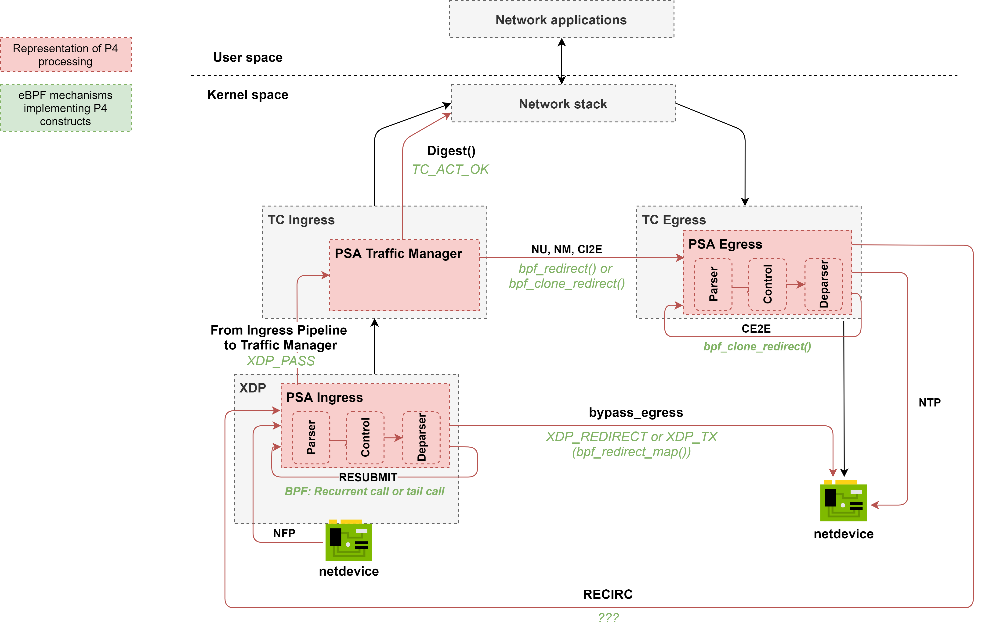

# Overview

The general design of PSA for eBPF is depicted in Figure below. For more details (sample implementation) please refer to 
[PoC of target architecture](../samples/full-arch).



The PSA program is decomposed into several eBPF programs that are intended to be attached to various hook points in the Linux kernel.

- `xdp-helper` - the "helper" program attached to the XDP hookpoint. The role of the `xdp-helper` program is to prepare
a packet for further processing in the TC subsystem. It might be also used to optimize performance by offloading ingress 
packet processing to XDP, but it can be done only for some P4 programs. 
- `tc-ingress` - In the TC Ingress, the P4 Ingress pipeline as well as so-called "Traffic Manager" eBPF program is attached. 
The Ingress pipeline is composed of Parser, Control block and Deparser. The details of Parser, Control block and Deparser implementation
will be explained further in this document. The same eBPF program in TC contains also the Traffic Manager. 
The role of Traffic Manager is to redirect traffic between the Ingress (TC) and Egress (TC). 
It is also responsible for packet cloning and sending packet to CPU (if `Digest` extern is used). 
- `tc-egress` - The PSA Egress pipeline (composed of Parser, Control block and Deparser) is attached to the TC Egress hook. As there is no 
XDP hook in the Egress path, the use of TC is mandatory for the egress processing.

# Rationale behind the current design

- The PSA specification differs from TNA or v1model in how the packets are processed after ingress processing is complete. 
There is the following sequence of operations: `clone() -> drop() -> resubmit() -> multicast() -> unicast()`. However, in case of
`clone()` and `resubmit()` a packet that is passed to these methods should be an unmodified, original packet. It causes the need to 
perform deparsing after (at least) `clone()` is be performed. This forces us to place the P4 Ingress pipeline in the TC Ingress hookpoint
and combine the P4 Ingress and Traffic Manager in the same eBPF program for TC. 
- To make packet recirculation possible, we assume there will be at least one "special" interface created called `PSA_PORT_RECIRCULATE`.
This port will have both Ingress and Egress pipelines attached to the TC hookpoint. Packets recirculated in the Egress will be send
to this port.

# Packet paths

## NFP (Normal Packet From Port)

Packet arriving on an interface is intercepted in the XDP hook by the `xdp-helper` program. It performs some pre-processing and 
packet is passed for further processing to the TC ingress. Note that there is no P4-related processing done in the `xdp-helper` program. 

By default, a packet is further passed to the TC subsystem. It is done by `XDP_PASS` action and packet is further handled by `tc-ingress` program.

## bypass_egress

**Note!** *It is not clear, if PSA can support this feature, but it is very useful feature used by TNA (Tofino Native Architecture).*

The purpose of this packet path is to send packet directly to the egress port, skipping the egress processing.
It can be done explicitly (in case of TNA by setting `bypass_egress` flag) or implicitly enforced by a compiler to improve performance.

In the XDP hook, it is implemented by using `XDP_REDIRECT` or `XDP_TX` action. However, it may be applied only in very limited number of cases.
For example, if there is no egress processing implemented in the P4 program and packet cloning is not performed either.

## Resubmit

The purpose of `RESUBMIT` is to transfer packet processing back to the Ingress Parser from Ingress Deparser.

We implement packet resubmission by calling main `ingress()` function in a loop. The `MAX_RESUBMIT_DEPTH` variable specifies
maximum number of resubmit operations. The `resubmit` flag defines whether the `tc-ingress` program should enter next iteration (resubmit)
or break the loop. Pseudocode:

```c
int i = 0;
int ret = TC_ACT_UNSPEC;
for (i = 0; i < MAX_RESUBMIT_DEPTH; i++) {
    out_md.resubmit = 0;
    ret = ingress(skb, &out_md);
    if (out_md.resubmit == 0) {
        break;
    }
}
```

## NU (Normal Unicast), NM (Normal Multicast), CI2E (Clone Ingress to Egress)

NU, NM and CI2E refer to process of sending packet from the Ingress Pipeline (more specifically from the Traffic Manager) 
to the Egress pipeline. The NU path is implemented in the eBPF subsystem by invoking the `bpf_redirect()` helper from 
the `tc-ingress` program. This helper sets an output port for a packet and the packet is further intercepted by the TC egress.

Both NM and CI2E require the `bpf_clone_redirect()` helper to be used. It redirects a packet to an output port, but also
clones a packet buffer, so that a packet can be copied and sent to multiple interfaces. The different between NM and CI2E is that
the former can copy a packet to multiple interfaces, while the latter creates only one copy of a packet and sends it to a "mirror" port.

From the eBPF program's perspective, `bpf_clone_redirect()` must be invoked in the loop to send packets to all ports from a multicast group.

## CE2E (Clone Egress to Egress)

CE2E refers to process of copying a packet that was handled by the Egress pipeline and resubmitting the cloned packet to the Egress Parser.

CE2E is implemented by invoking `bpf_clone_redirect()` helper in the Egress path. Output ports are determined based on the 
`clone_session_id` and lookup to "clone_session" BPF map, which is shared among TC ingress and egress (eBPF subsystem allows for map sharing between programs). 

## Sending packet to CPU

With PSA, there are two options to send packet to CPU. One mechanism is to use the `Digest` extern. Another is to send
a packet to the control plane via the post numbered `PSA_PORT_CPU`. 

### Using PSA_PORT_CPU

This method does not differ significantly from normal packet unicast. A control plane application should listen for new
packets on the interface identified by `PSA_PORT_CPU` in a P4 program. By redirecting a packet to `PSA_PORT_CPU` in the Ingress pipeline
the packet is forwarded via Traffic Manager to the Egress pipeline and then, sent to the "CPU" interface.

### Using Digest extern

The `Digest` extern causes a packet to be "digested" from the packet processing to CPU. `Digest` can be used in the Deparser
of the Ingress pipeline. A packet that has been "digested" is passed to CPU. In the context of eBPF, it is implemented by 
using the BPF map of type `BPF_MAP_QUEUE`. The `tc-ingress` program constructs structure to be digested and inserts it to the
queue map. Digest message can be further read by a control plane application.

## NTP (Normal packet to port)

Packets from `tc-egress` are directly passed to the egress port (without the egress XDP hook, which is not available).
The egress port is determined in the Ingress pipeline and is not changed in the Egress pipeline. 

## Recirculation

The purpose of `RECIRC` is to transfer packet processing back from Egress Deparser to the Ingress Parser.

In order to implement `RECIRC` we assume the existence of `PSA_PORT_RECIRCULATE`. Therefore, recirculation is simply performed by
invoking `bpf_redirect()` to the `PSA_PORT_RECIRCULATE` port with `BPF_F_INGRESS` flag to enforce processing a packet by the Ingress pipeline. 

# Metadata

There are some global metadata defined for the PSA architecture. For example, `packet_path` must be shared among different pipelines.
To share a global metadata between pipelines we will use `skb->cb` (control buffer), which gives us 20B that are free to use.

# Match-Action tables

## Ternary

If one of the key fields has type ternary, the whole table becomes ternary table. As there is no built-in 
ternary lookup algorithm, the p4c-ebpf-psa compiler use a combination of hash and array maps to implement
Tuple Space Search (TSS) algorithm. 

When inserting a new table entry to a ternary table a control plane must construct map key similarily to how 
p4c-ebpf-psa does it. Basically, p4c-ebpf-psa sorts key in descending order of key width to avoid gaps. 
See the example below:

```
bit<8>  hdr.ipv4.protocol;
bit<8>  hdr.ipv4.diffserv;
bit<32> hdr.ipv4.dstAddr;
key = {
    hdr.ipv4.protocol : exact;
    hdr.ipv4.diffserv : ternary;
    hdr.ipv4.dstAddr :  lpm;
}
```

The above P4 table's key will be translated to:

```c
struct tbl_ternary_key {
    __u32 field3;
    __u8  field1;
    __u8  field2;
};
```

Note that key fields of equal width will not be shuffled.

**Note!** A huge number of prefixes causes a huge number of iterations to be made in an eBPF program. 
Therefore, in case of ternary table we easily reach maximum number of instructions (1M) allowed. Due to this reason,
we decided to set maximum number of prefixes to `MAX_MASKS = 256`. If this limit will be reached, a control plane
will not be allowed to insert new rules. However, we expect it will be rather rare situation as so huge number of 
prefixes/masks is not frequently observed, even in production deployments.


